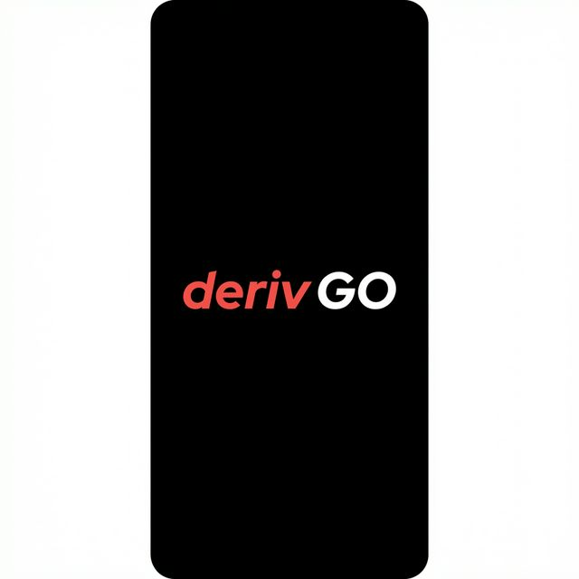

# TradeCraft Arena

<p align="center">
  
</p>

<p align="center">
  <strong>Build your strategy. Deploy your bots. Conquer the leaderboard.</strong>
</p>

<p align="center">
  <a href="#features">Features</a> •
  <a href="#installation">Installation</a> •
  <a href="#usage">Usage</a> •
  <a href="#architecture">Architecture</a> •
  <a href="#contributing">Contributing</a>
</p>

---

## Overview

**TradeCraft Arena** is a gamified trading strategy builder for the [Deriv](https://deriv.com) platform. It turns the complex world of algorithmic trading into an intuitive, game-like experience where users build, test, and deploy automated trading strategies.

Built for the **Deriv's Got Talent** hackathon, this React Native app combines visual programming concepts with real-time market data integration.

## Features

### 🎮 Visual Strategy Builder ("The Workshop")
- Drag-and-drop puzzle piece interface
- Pre-built strategy blocks for common trading patterns
- Real-time visual feedback on strategy flow

### 🧩 3D Routine Viewer
- Interactive 3D canvas for viewing strategy routines
- Pan and zoom controls
- Landscape orientation for maximum visibility

### 📊 Live Deployment
- Connect to Deriv's WebSocket API for real-time market data
- Simulated and live trading modes
- Performance tracking with visual feedback

### 🎭 Judges' Table
- Animated judge characters providing real-time commentary
- Performance analysis and scoring system
- Gamified feedback on trading decisions

### 🏆 Leaderboard
- Track and compare strategy performance
- Competitive elements to encourage optimization

## Tech Stack

| Category | Technology |
|----------|------------|
| Framework | React Native + Expo |
| 3D Graphics | React Three Fiber + Three.js |
| UI Components | React Native Paper |
| Animations | React Native Reanimated |
| API | Deriv WebSocket API |
| State | React Context + Hooks |
| Typography | Poppins (Google Fonts) |

## Installation

### Prerequisites

- Node.js 18+
- npm or yarn
- Expo CLI (`npm install -g expo-cli`)
- iOS Simulator (Xcode) or Android Emulator

### Quick Start

```bash
# Clone the repository
git clone https://github.com/yourusername/tradecraft-arena.git
cd tradecraft-arena

# Install dependencies
npm install

# Start the development server
npx expo start
```

### Running on Device

```bash
# iOS
npx expo run:ios

# Android
npx expo run:android

# Web (experimental)
npx expo start --web
```

## Usage

### Building a Strategy

1. **Open The Workshop** from the home screen
2. **Select blocks** from the categories:
   - Entry triggers
   - Exit conditions
   - Risk management
   - Filters
3. **Connect pieces** by dragging them together
4. **Validate** your strategy before deployment

### Deploying a Strategy

1. Navigate to **Deployment** screen
2. Choose between:
   - **Rehearsal** (simulated data)
   - **Live Show** (real market data)
3. Monitor performance through the **Judges' Table**
4. End deployment to view results

## Architecture

```
src/
├── api/              # WebSocket and API integrations
│   └── websocket.js  # Deriv WS connection & simulator
├── components/       # Reusable UI components
│   ├── AnalystPanel.js
│   ├── LiveChart.js
│   └── SystemHealth.js
├── context/          # React Context providers
│   └── DerivAuthContext.js
├── game/             # Game logic
│   └── degradationLogic.js
├── hooks/            # Custom React hooks
│   └── useDerivTicks.js
├── screens/          # App screens
│   ├── HomeScreen.js
│   ├── BuilderScreen.js
│   ├── RoutineScreen.js
│   ├── DeploymentScreen.js
│   └── ReplayScreen.js
├── storage/          # Local storage utilities
└── theme.js          # Design system tokens
```

## Deriv Integration

TradeCraft Arena integrates with Deriv's APIs:

- **WebSocket API** - Real-time tick data streaming
- **Authentication** - OAuth2 token flow (optional)
- **Deriv Bot Export** - Export strategies as Deriv Bot XML

### Connecting to Deriv

1. Toggle between simulation and live data on the Deployment screen
2. For live data, authenticate with your Deriv account
3. Strategies can be exported for use with Deriv Bot

## Design Philosophy

### "Deriv's Got Talent" Theme

The app uses a talent show metaphor:
- **Strategies** = Performances
- **Blocks** = Routine elements
- **Deployment** = Live show
- **Judges** = Market analysts

### Visual Design

- **AMOLED-optimized dark theme**
- **Vibrant accent colors** (Deriv red/coral)
- **Poppins typography** for modern, clean text
- **Glassmorphism** and subtle animations

## Contributing

Contributions are welcome! Please read our contributing guidelines before submitting PRs.

1. Fork the repository
2. Create a feature branch (`git checkout -b feature/amazing-feature`)
3. Commit changes (`git commit -m 'Add amazing feature'`)
4. Push to branch (`git push origin feature/amazing-feature`)
5. Open a Pull Request

## License

This project is licensed under the MIT License - see the [LICENSE](LICENSE) file for details.

## Acknowledgments

- Built for the **Deriv's Got Talent** hackathon
- Developed by **BlackLotus**
- Powered by [Deriv](https://deriv.com) APIs

---

<p align="center">
  Made with ❤️ for the trading community
</p>
